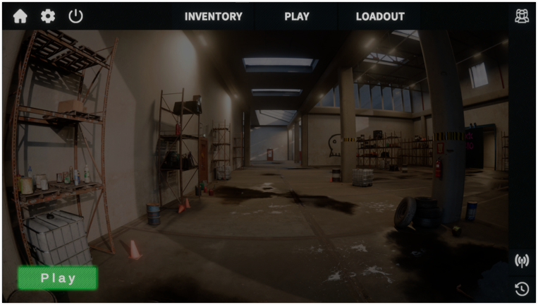
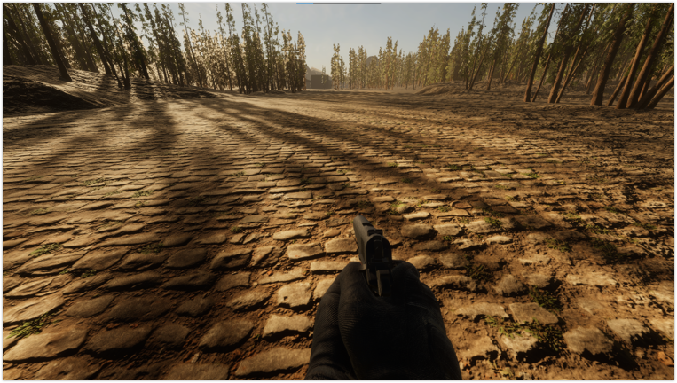
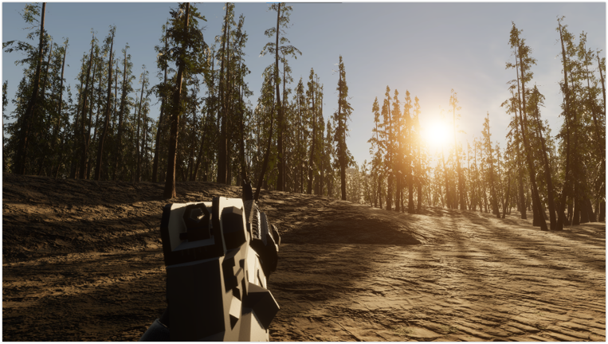
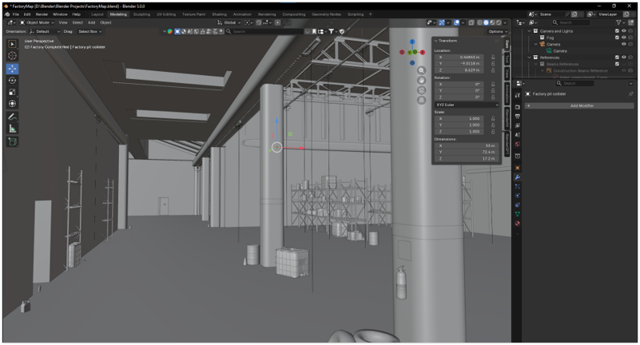
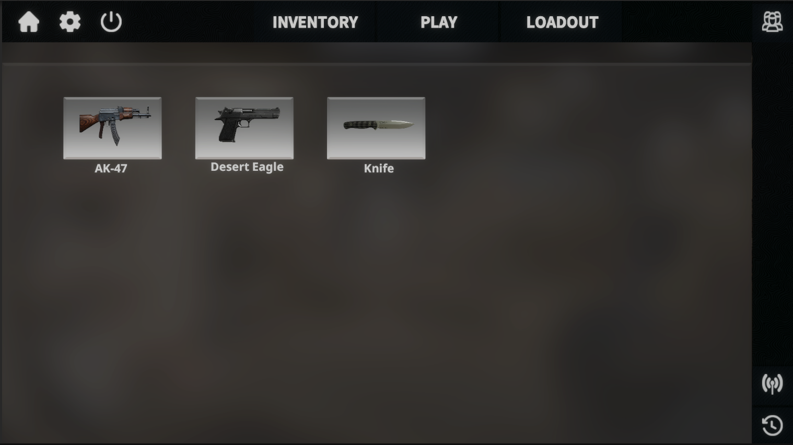
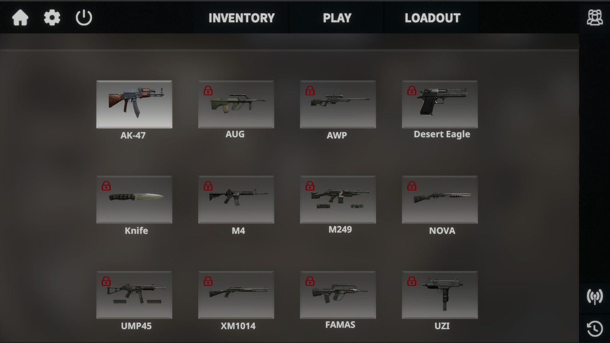
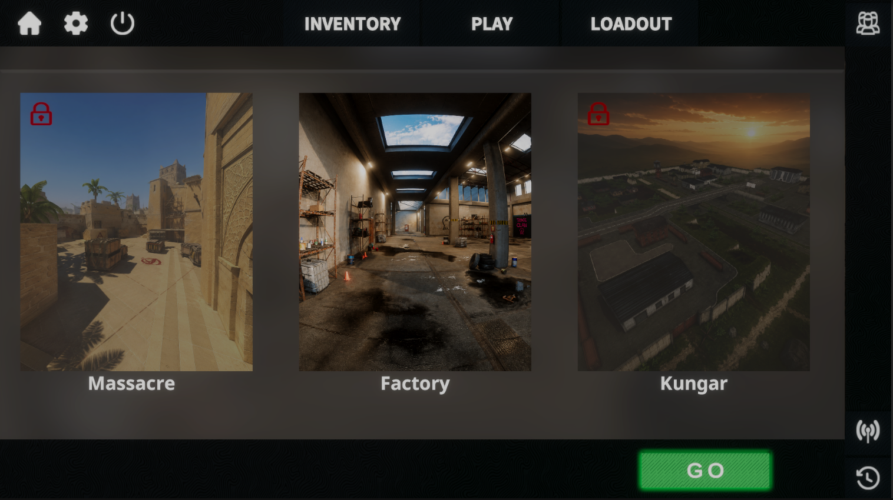

# 🎮 OmniRaid

### A First-Person Shooter Prototype developed in Unity

 

---

# 📖 Overview

OmniRaid is a **First-Person Shooter (FPS) prototype** developed as a **Final Year Project** using **Unity 6**.

The project focuses on creating a realistic FPS experience with polished gameplay presentation and a modern user interface. Although the project is currently in the prototype stage, it establishes a strong foundation for future multiplayer development.

The long-term vision for OmniRaid is to evolve into a complete online multiplayer FPS featuring networking, backend services, AI-driven enemies, progression systems, and additional gameplay mechanics.

---

# 🚧 Project Status

> **Current Status:** Prototype (In Development)

The current version demonstrates the game's core structure, including player interaction, weapon mechanics, and interface design.

Planned future development includes:

- Multiplayer using Photon Fusion
- PlayFab Backend Integration
- Enemy AI
- Inventory System
- Player Progression
- Additional Weapons
- Multiple Maps
- Matchmaking System

---

# 🎥 Gameplay Video

Watch the latest gameplay here:

### ▶️ https://youtu.be/WZ_zXlLDHK4

---

# 🛠️ Built With

| Category | Technologies |
|----------|--------------|
| Game Engine | Unity 6 (6000.3.15f1) |
| Programming | C# |
| UI Design | Adobe Photoshop, Adobe Illustrator |
| 3D Assets | Blender 4.2 |
| Version Control | Git & GitHub |

---

# ✨ Current Features

- First Person Controller
- Player Movement
- Sprint
- Jump
- Crouch
- Shooting System
- Weapon Switching
- Aim Down Sights (ADS)
- Weapon Pickup
- Main Menu
- Pause Menu
- User Interface (HUD)
- Scene Management
- Animation
- Audio Integration

---

# Omniraid
A First-Person Shooter prototype developed in Unity.

## Screenshots

### Main Menu

### Gameplay

### Environment

### Blender Environment

### Inventory(Only UI)

### Loadout(only UI)

### Map Selection Interface

## 🎥 Gameplay Video

Watch the gameplay demonstration on YouTube:

[▶️ Watch OmniRaid Gameplay](https://youtu.be/WZ_zXlLDHK4)
